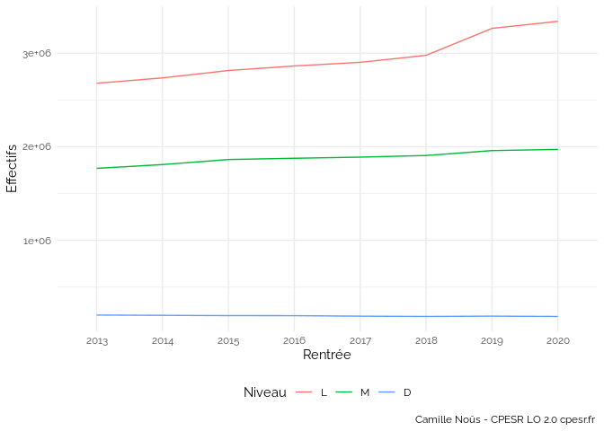

cpesrthemes
================

Collections d’aides pour la mise en forme des travaux de la CPESR.

## ggcpesrthemes

Package R pour la production de graphiques.

### Installation

``` r
devtools::install_github("cpesr/cpesrthemes", subdir="ggcpesrthemes")
```

### Utilisation

-   Juste le thème

``` r
library(ggplot2)
library(ggcpesrthemes)
ggplot(esr, aes(x=Rentrée, y=Effectifs, color=Niveau, group=Niveau)) + 
  geom_line() + 
  theme_cpesr() 
```

<!-- -->

-   Thème et caption par défaut

``` r
library(ggplot2)
library(ggcpesrthemes)
ggplot(esr, aes(x=Rentrée, y=Effectifs, color=Niveau, group=Niveau)) + 
  geom_line() + 
  theme_cpesr_cap() 
```

<!-- -->

-   Thème et caption personnalisés

``` r
library(ggplot2)
library(ggcpesrthemes)
ggplot(esr, aes(x=Rentrée, y=Effectifs, color=Niveau, group=Niveau)) + 
  geom_line() + 
  theme_cpesr_cap(authors=c("Author One","Author Two"), 
              camille=FALSE, 
              licence="CC BY-SA",
              url="https://github.com/cpesr/cpesrthemes",
              source="https://data.enseignementsup-recherche.gouv.fr")
```

<!-- -->

-   Thème et caption personnalisés globalement

``` r
library(ggplot2)
library(ggcpesrthemes)

theme_cpesr_setup(authors=c("Author One","Author Two"), 
                  camille=FALSE, 
                  licence="CC BY-SA",
                  url="https://github.com/cpesr/cpesrthemes",
                  source="https://data.enseignementsup-recherche.gouv.fr")

ggplot(esr, aes(x=Rentrée, y=Effectifs, color=Niveau, group=Niveau)) + 
  geom_line() + 
  theme_cpesr_cap()
```

<!-- -->

### Customization

-   `x_grid = FALSE`

``` r
library(ggplot2)
library(ggcpesrthemes)
ggplot(esr, aes(x=Rentrée, y=Effectifs, color=Niveau, group=Niveau)) + 
  geom_line() + 
  theme_cpesr(x_grid = FALSE) 
```

<!-- -->

-   `x_ticks = TRUE`

``` r
library(ggplot2)
library(ggcpesrthemes)
ggplot(esr, aes(x=Rentrée, y=Effectifs, color=Niveau, group=Niveau)) + 
  geom_line() + 
  theme_cpesr(x_ticks = TRUE) 
```

<!-- -->

-   `y_grid = FALSE`

``` r
library(ggplot2)
library(ggcpesrthemes)
ggplot(esr, aes(x=Rentrée, y=Effectifs, color=Niveau, group=Niveau)) + 
  geom_line() + 
  theme_cpesr(y_grid = FALSE) 
```

<!-- -->

-   `y_ticks = TRUE`

``` r
library(ggplot2)
library(ggcpesrthemes)
ggplot(esr, aes(x=Rentrée, y=Effectifs, color=Niveau, group=Niveau)) + 
  geom_line() + 
  theme_cpesr(y_ticks = TRUE) 
```

<!-- -->

-   `minor_grid = FALSE`

``` r
library(ggplot2)
library(ggcpesrthemes)
ggplot(esr, aes(x=Rentrée, y=Effectifs, color=Niveau, group=Niveau)) + 
  geom_line() + 
  theme_cpesr(minor_grid = FALSE) 
```

<!-- -->
